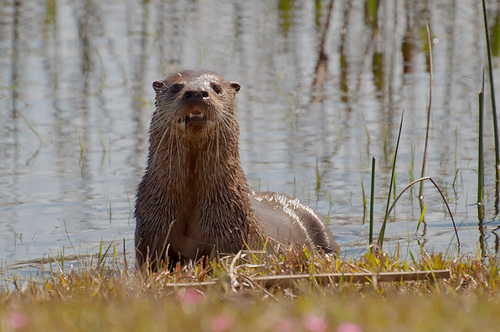

Cada vez mais dados sobre a distribuição de espécies estão sendo compilados e disponibilizados gratuitamente em diversas plataformas (GBIF, iNaturalist, CITES). Ao mesmo tempo, dados climáticos cada vez mais precisos são gerados e disponibilizados. Isso traz enormes possibilidades para testar e comparar a área de ocorrência de espécies de interesse para diversos propósitos. O conjunto de ferramentas conhecido como **Species Distribution Modeling (SDM)** combinam dados de ocorrência (variável resposta) com parâmetros ambientais (variáveis preditoras), geralmente são utilizados para prever a distribuição de espécies em cenários atuais e/ou futuros. Para mais detalhes sobre essa abordagem sugiro a leitura de [@barve2011crucial]. Dito isto, proponho de mostrar de forma breve e superficial a ulização de um "SDM" para prever a área de ocorrência da lontra neotropical (*Lontra longicaudis*) utilizando dados climáticos. Ressalto que esse contéudo tem caratér exclusivamente didático e não deve ser tratado como informação de valor cientifico. 

##Lontra neotropical
Alguns estudos já utilizaram dessa abordagem para testar hipóteses sobre a área de ocorrência [@rheingantz2014defining] (citar) e sobre a história evolutiva [@hernandez2018role] da lontra netropical. O que tornara o trabalho mais facil pois iremos selecionar as váriáveis ambientais que explicam a ocorrência das lontras. 

 
 


##Passo-a-passo SDM

###Coletando dados
Os dados de ocorrência de *Lontra longicaudis* foram compilados da plataforma **Global Biodiversity Information Facility (GBIF)** e estão diposineis no seguinte link: https://doi.org/10.15468/dl.jfvbtt

###Pacotes utilizados
```{r message=FALSE, warning=FALSE}
#Carregar pacotes
library("sp")
library("raster")
library("maptools")
library("rgdal")
library("dismo")
library("tidyverse")
library("sf")
```

```{r message=FALSE, warning=FALSE}
#Criando diretórios
dir.create(path = "data")
dir.create(path = "output")
```

###Carregando dados
```{r}
obs.data<- read.csv(file = "occurrence_lontra.csv", sep = ";")
obs.data <- obs.data[!is.na(obs.data$decimalLatitude), ] #remover NAs do data.frame
obs.data<- obs.data %>% 
  filter(decimalLongitude < -20) %>% 
  filter(decimalLatitude > -65)
```

###Obtendo dados climáticos
Utilizaremos a base de dados do `bioclim`, no entanto, selecionaremos somente as váriaveis climáticas que tenham valor biológico/ecológico (citar trabalho). Bioclim consiste em um conjunto de 19 variáveis climáticas medidas mensalmente e são bastante utilizadas para modelos de distribuição de espécies. Para mais informações acesse: https://www.worldclim.org/data/bioclim.html

```{r}
bioclim.data <- getData(name = "worldclim",
                        var = "bio",
                        res = 5,
                        path = "",
                        lon = max.lon,
                        lat = max.lat)
bioclim.data2<- bioclim.data[[c("bio1","bio2","bio4","bio5","bio7","bio12","bio14","bio15","bio18","bio19")]] #selecionando o subconjunto de variáveis
```

###Determinar coodernadas geográficas para o modelo
```{r}
max.lat <- ceiling(max(obs.data$decimalLatitude))
min.lat <- floor(min(obs.data$decimalLatitude))
max.lon <- ceiling(max(obs.data$decimalLongitude))
min.lon <- floor(min(obs.data$decimalLongitude))
coords <- extent(x = c(min.lon, max.lon, min.lat, max.lat))
```

##Construindo o modelo
Utilizaremos o algoritimo bioclim para modelar a distribuição das espécies em relação as variáveis climáticas. O algoritimo compara a similaridade dos valores climáticos de locais em que a espécie a ser modelada ocorre (dados treino) e com outros locais em que a espécie não foi amostrada. Gerando um valor de probabilidade da ocorrência da espécie em determinada área.
```{r}
bioclim.data1 <- crop(x = bioclim.data2, y = coords) #juntar coordenadas com dados climáticos
obs.data <- obs.data[, c("decimalLongitude", "decimalLatitude")] 
model1 <- bioclim(x = bioclim.data2, p = obs.data) #modelo construido com o algoritimo bioclim
predict.presence1 <- dismo::predict(object = model1, 
                                    x = bioclim.data1, 
                                    ext = coords) #Prever a presença baseado no modelo
```

###Visualizando o modelo
```{r}
# Mapa base
data(wrld_simpl)
plot(wrld_simpl, 
     xlim = c(min.lon, max.lon),
     ylim = c(min.lat, max.lat),
     axes = TRUE, 
     col = "grey95")

# Adicionar probabilidades do modelo
plot(predict.presence1, add = TRUE,xlim = c(min.lon, max.lon),
     ylim = c(min.lat, max.lat))

# Adicionar pontos observados
points(obs.data$decimalLongitude, obs.data$decimalLatitude, col = "olivedrab", pch = 20, cex = 0.75)
plot(wrld_simpl, add = TRUE, border = "grey5")
box()
```

O mapa mostra a probabilidade da distribuição da lontra neotropical. 

##Validando o modelo
É necessário avaliar o modelo em relação ao seu poder de predição. Para isso o conjunto de dados será separado em "dados treino", representado 20% dos dados e "dados teste", representando 80%. Para isso utilizaremos a função kfold do pacote dismo para atribuir a cada observação um grupo aleatório. 

```{r}
testing.group <- 1
group.presence <- kfold(x = obs.data, k = 5) 
table(group.presence)
presence.train <- obs.data[group.presence != testing.group, ]
count(presence.train)
presence.test <- obs.data[group.presence == testing.group, ]
count(presence.test)
```

###Construindo o modelo e testando
```{r}
# Construir modelo com dados treino
model2 <- bioclim(x = bioclim.data2, p = presence.train)

# Prever a presença do modelo
predict.presence2 <- dismo::predict(object = model2, 
                                    x = bioclim.data2, 
                                    ext = coords)

# Usar dados teste para avaliar o modelo 
bc.eval1 <- evaluate(p = presence.test,   # Dados teste
                     a = presence.train, # Dados treino
                     model = model2,    # Modelo avaliado
                     x = bioclim.data2)    # variáveis climáticas

bc.threshold1 <- threshold(x = bc.eval1, stat = "spec_sens")
```

###Representação visual do modelo
```{r message=FALSE, warning=FALSE}
#MAP
world_map <- map_data("world")
raster<- as.data.frame(predict.presence2, xy=T) %>% drop_na()
raster2<- raster %>% filter(raster$layer > bc.threshold1 )

g1<- ggplot() +
  geom_raster(data = raster2, aes(x = x, y = y, fill = layer)) +scale_fill_gradient(low="yellow",high = "darkgreen")+ theme_classic() +
  geom_polygon(data = world_map,aes(x = long, y = lat, group = group), fill = NA, col = "black") + 
  coord_sf(xlim = c(min.lon, max.lon), ylim = c(min.lat, max.lat), expand = FALSE) +xlab("Longitude")+ ylab("Latitude") +
  geom_point(aes(x=obs.data$decimalLongitude, y = obs.data$decimalLatitude))
g1
```

Como podemos notar a abrangência da distribuição da lontra neotropical aumentou muito com a utilização desse modelo preditivo. Vale ressaltar que esse tipo de modelagem só levou em conta dados climáticos. Provavelmente outros fatores como: (1) barreiras geográficas intransponíveis, (2) presença de predadores/competidores e (3) disturbios antrópicos influenciam a distribuição e ocorrência desse animal.

Temos então um panorama inicial de como utlizar essa abordagem para prever a ocorrência de uma espécie.

Qualquer dúvida, correção ou sugestão pode ser encaminhada para gfellipe5@gmail.com

Obrigado.

#Referências


